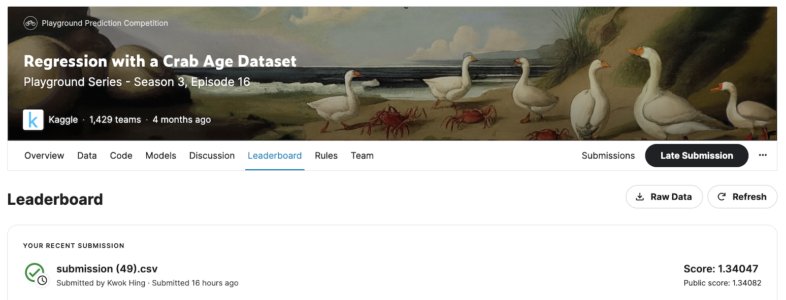

## Regression with a Crab Age Dataset

This repo provides the submission entry for a [kaggle challenge](https://www.kaggle.com/competitions/playground-series-s3e16/overview) to create a regression model to predict a crab's age. 

## Getting started
Open `DsCoP Kaggle - Ensemble.ipynb` on a jupyter notebook environment. Alternatively, you can view the codes in . The notebook consists of further technical details.
